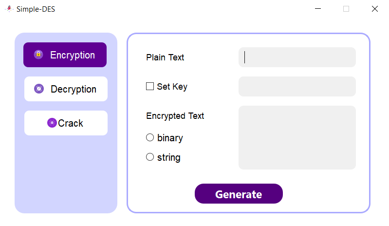

# Simple_DES

English | <a href='./docs/README.zh-CN.md'>简体中文</a>

This is a homework of the CQU course - introduction of information security.

It mainly implements a simple DES encryption algorithm, with a fixed key length of 10 bits and 8-bit data as a group for encryption. Designed with a GUI interface, it supports two input modes: string and binary string. And a cracking module was written to use enumeration to brute force the key.

**The ./docs directory stores relevant test results, user manuals and development manuals required by the task.**


The program interface is as follows:



Quickly deploy and start (make sure your computer has python and git installed before):

```
git clone https://github.com/Jiewoe/Simple_DES.git
cd Simple_DES
pip install -r requirements.txt
python main.py
```