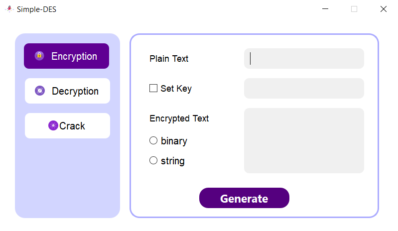

# Simple_DES

<a href='../README.md'>English</a> | 简体中文

本仓库为重庆大学大数据软件学院信息安全导论课程作业，主要实现了一个简易的DES加密算法，密钥长度为固定的10bit，以8bit数据为一组进行加密。设计有GUI界面，支持字符串和二进制串两种输入模式。并且编写了破解模块，采用枚举的方式对密钥进行暴力破解。

**./docs目录下存放了作业要求的相关测试结果、用户手册以及开发手册**

程序界面如下：


快速部署并启动（确保此前您的电脑已安装有python、git）：

```
git clone https://github.com/Jiewoe/Simple_DES.git
cd Simple_DES
pip install -r requirements.txt
python main.py
```

